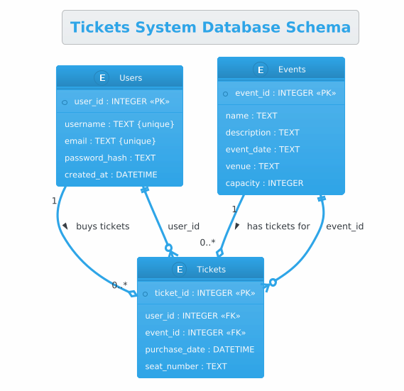

#### Spending weekends to explore how AI assist me coding...

#### Setup
- Use Linux WSL2 on Windows
- Ensure to have GPU, project has tested with 12GB RTX-4070
- Apply `continue` extension from vscode and have settings to use gemma4:latest
- Can monitor GPU when docker services started, http://localhost:1312
- Ensure [Nvidia Tool Kit](https://oneuptime.com/blog/post/2026-01-16-docker-nvidia-gpu-ai-ml/view#ubuntu-debian) installed
```
# Add NVIDIA package repository
curl -fsSL https://nvidia.github.io/libnvidia-container/gpgkey | \
  sudo gpg --dearmor -o /usr/share/keyrings/nvidia-container-toolkit-keyring.gpg

curl -s -L https://nvidia.github.io/libnvidia-container/stable/deb/nvidia-container-toolkit.list | \
  sed 's#deb https://#deb [signed-by=/usr/share/keyrings/nvidia-container-toolkit-keyring.gpg] https://#g' | \
  sudo tee /etc/apt/sources.list.d/nvidia-container-toolkit.list

# Install the toolkit
sudo apt-get update
sudo apt-get install -y nvidia-container-toolkit

# Configure Docker to use NVIDIA runtime
sudo nvidia-ctk runtime configure --runtime=docker

# Restart Docker
sudo systemctl restart docker
```
- Add Docker LLM model pulling support (model-runner from Docker Desktop)
```
# support docker model-runner plugin
sudo apt-get update
sudo apt-get install docker-model-plugin
docker model version
```
- Pulling using document [here](https://medium.com/google-cloud/running-an-ai-agent-locally-adk-gemma-4-and-docker-model-runner-95ca9e6f506d), and [here](https://medium.com/@bhaskaro/docker-model-runner-demystified-a-practical-guide-to-running-local-llms-like-containers-895af3ddcb0c) and [here](https://theaiops.substack.com/p/docker-model-runner-pull-llms-from) and llm image info [here](https://hub.docker.com/r/ai/gemma4)
```
docker model pull ai/gemma4:E4B

docker model show gemma4:E4B | head -10
Model:       sha256:1163f19dcd973b865c35d8e1a2c03736f4eb0a98c71e2b4425b7f84d183a423f
Tags:        docker.io/ai/gemma4:E4B
Created:     2026-04-08T08:44:04-07:00

Format:       gguf
Architecture: gemma4
Parameters:   7.52B
Size:         4.74GiB
Quantization: MOSTLY_Q4_K_M
```
- Review docker image types [here](https://github.com/ggml-org/llama.cpp/blob/master/docs/docker.md) llama.cpp. It does not work for me since docker run returns 139 error code. If you can see nvidia-smi with good output, then image has issue.
```
docker run --gpus 1 ghcr.io/ggml-org/llama.cpp
:server-cuda13 /app/llama-server --port 8080 --host 0.0.0.0 -n 512 --n-gpu-layers 1 --docker-repo ai/gemma4:
E4B --debug
echo $?
139

docker run --rm -it --gpus all nvidia/cuda:13.0.2-devel-ubuntu24.04 nvidia-smi
+-----------------------------------------------------------------------------------------+
| NVIDIA-SMI 595.58.04              Driver Version: 596.21         CUDA Version: 13.2     |
+-----------------------------------------+------------------------+----------------------+
| GPU  Name                 Persistence-M | Bus-Id          Disp.A | Volatile Uncorr. ECC |
| Fan  Temp   Perf          Pwr:Usage/Cap |           Memory-Usage | GPU-Util  Compute M. |
|                                         |                        |               MIG M. |
|=========================================+========================+======================|
|   0  NVIDIA GeForce RTX 4070        On  |   00000000:01:00.0  On |                  N/A |
|  0%   36C    P8              5W /  200W |    1210MiB /  12282MiB |      1%      Default |
|                                         |                        |                  N/A |
+-----------------------------------------+------------------------+----------------------+
```
- [How to build it locally](https://github.com/ggml-org/llama.cpp/blob/master/docs/docker.md#building-docker-locally) 
```
git clone https://github.com/ggml-org/llama.cpp.git
docker build -t local/llama.cpp:server-cuda12 --target server -f .devops/cuda.Dockerfile .
```

#### Pairing with AI

- Chat with AI for couple hours to let assistant to write typescript codes
    * Ask for new tickets system schema
    * Help on Plant UML for schema diagram
    * Setup typescript project (needs human to guide this one)
    * Can connect to database 
    * Bootstrap the new database and push schema changes with typescript code (node human as well)
    * Search tickets and users information from dataset
    * ~~Contain code bug that query resultset from sqlite3 and AI cannot find good answer~~  Fix in [this commit](https://github.com/boonchu/ai_code_assistant/commit/66bb8647560abfee685823f58f86125eeed2a374)
    * "MUST" commit git every time before AI made code changes. Otherwise lost all codes since AI can wipe out 30-50% original codes.

* schema design



* setup database

```
# create database with defined schema in code.
npx tsx src/setupDatabase.ts

# export schema
sqlite3 tickets.db .schema

# append new dataset
sqlite3 tickets.db < ./data/data.sql 
```

* search from dataset

```
# Charlie buys tickets for the Tech Summit
SELECT
    T.seat_number,
    T.purchase_date
FROM
    Tickets T
JOIN
    Users U ON T.user_id = U.user_id
JOIN
    Events E ON T.event_id = E.event_id
WHERE
    U.username = 'charlie_coder' AND E.name = 'Annual Tech Summit';

# who attend Music Festival
SELECT
    U.username AS user_name,
    E.name AS event_name,
    T.seat_number,
    T.purchase_date
FROM
    Tickets T
JOIN
    Users U ON T.user_id = U.user_id
JOIN
    Events E ON T.event_id = E.event_id
WHERE
    E.name = 'Local Music Festival';

# never attend Music Festival
SELECT
    username,
    email
FROM
    Users
WHERE
    user_id NOT IN (
        SELECT
            T.user_id
        FROM
            Tickets T
        JOIN
            Events E ON T.event_id = E.event_id
        WHERE
            E.name = 'Local Music Festival'
    );
```
