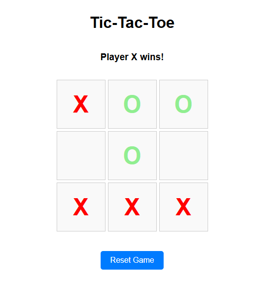

#### Spending weekends to explore how AI assist me coding...

### Setup `docker-llama-cpp-app`
- Use Linux WSL2 on Windows
- Ensure to have GPU, project has tested with 12GB RTX-4070
- Apply `Continue` or `Cline` extension from vscode and have settings to use gemma4:E4B
    - `Continue` is better since it pass through my prompt to service.
- Can monitor GPU when docker services started, http://localhost:1312
- Ensure [Nvidia Tool Kit](https://oneuptime.com/blog/post/2026-01-16-docker-nvidia-gpu-ai-ml/view#ubuntu-debian) installed
```
# Add NVIDIA package repository
curl -fsSL https://nvidia.github.io/libnvidia-container/gpgkey | \
  sudo gpg --dearmor -o /usr/share/keyrings/nvidia-container-toolkit-keyring.gpg

curl -s -L https://nvidia.github.io/libnvidia-container/stable/deb/nvidia-container-toolkit.list | \
  sed 's#deb https://#deb [signed-by=/usr/share/keyrings/nvidia-container-toolkit-keyring.gpg] https://#g' | \
  sudo tee /etc/apt/sources.list.d/nvidia-container-toolkit.list

# Install the toolkit
sudo apt-get update
sudo apt-get install -y nvidia-container-toolkit

# Configure Docker to use NVIDIA runtime
sudo nvidia-ctk runtime configure --runtime=docker

# Restart Docker
sudo systemctl restart docker
```

- Review docker image types [here](https://github.com/ggml-org/llama.cpp/blob/master/docs/docker.md) llama.cpp. When you can see nvidia-smi with good output, then environment setup has no issue.
```
$ docker run --rm -it --gpus all nvidia/cuda:13.0.2-devel-ubuntu24.04 nvidia-smi
+-----------------------------------------------------------------------------------------+
| NVIDIA-SMI 595.58.04              Driver Version: 596.21         CUDA Version: 13.2     |
+-----------------------------------------+------------------------+----------------------+
| GPU  Name                 Persistence-M | Bus-Id          Disp.A | Volatile Uncorr. ECC |
| Fan  Temp   Perf          Pwr:Usage/Cap |           Memory-Usage | GPU-Util  Compute M. |
|                                         |                        |               MIG M. |
|=========================================+========================+======================|
|   0  NVIDIA GeForce RTX 4070        On  |   00000000:01:00.0  On |                  N/A |
|  0%   36C    P8              5W /  200W |    1210MiB /  12282MiB |      1%      Default |
|                                         |                        |                  N/A |
+-----------------------------------------+------------------------+----------------------+

docker run --gpus 1 ghcr.io/ggml-org/llama.cpp:server-cuda --port 8080 --host 0.0.0.0 -n 512 --n-gpu-layers 1 --docker-repo ai/gemma4:E4B
```
- [How to build it locally](https://github.com/ggml-org/llama.cpp/blob/master/docs/docker.md#building-docker-locally) 
```
git clone https://github.com/ggml-org/llama.cpp.git
docker build -t local/llama.cpp:server-cuda12 --target server -f .devops/cuda.Dockerfile .
```
#### Before `running docker compose up -d`
- Note that the current docker compose still need to tune llama.cpp to incorparate with model in docker model-runner. not sure yet if this is the right way to do so when use docker model with llama.cpp. 
- Create directory llama_cache and set the Setgid Bit (For Shared Access)
```
mkdir -p llama_cache/slots
chmod -R 2775 ./llama_cache
sudo chgrp -R $(id -g) ./llama_cache
```
- Create docker network for connecting multiple docker projects.
```
docker network create ai-network
```
- When model download start, you should see this:
```
$ rg --files  llama_cache/

llama_cache/ai_gemma4_E4B.gguf.downloadInProgress
```

#### Find best model to fit your local machine
```
git clone git@github.com:AlexsJones/llmfit.git
cd llmfit

# pipe to jq to find best "fit" model for "llama.cpp".
$ docker build -t llmfit-tui-image . && docker run --gpus all -it llmfit-tui-image | jq '.models[] | select(.runtime | contains("llama.cpp"))' | jq -r 

  "name": "deepseek-ai/DeepSeek-Coder-V2-Lite-Instruct",
  "notes": [
    "Context capped at 8192 tokens for estimation (model supports up to 6553600; use --max-context to override)",
    "GPU: model loaded into VRAM",
    "MoE: all 64 experts loaded in VRAM (optimal)",
    "Baseline estimated speed: 119.2 tok/s"
  ],
  "parameter_count": "15.7B",

  "name": "Intel/Qwen3-Coder-Next-int4-AutoRound",
  "notes": [
    "Context capped at 8192 tokens for estimation (model supports up to 262144; use --max-context to override)",
    "GPU: model loaded into VRAM",
    "MoE: all 512 experts loaded in VRAM (optimal)",
    "Best quantization for hardware: Q6_K (model default: Q4_K_M)",
    "Baseline estimated speed: 139.4 tok/s"
  ],
  "parameter_count": "11.8B",
```
#### You can help to improve LLM with challenge in this project, ['Pelicans on a bicycle'](https://github.com/simonw/pelican-bicycle#pelicans-on-a-bicycle)
- Access http://localhost:8080/
- Type this Prompt `Generate an SVG of a pelican riding a bicycle`
- Dump SVG in vscode to see what image look like.
- Tune Llama.CPP in docker-compose.yml to get image better natually.

#### Testing with Opencode
- Setup with `npm install -g opencode-ai@latest`
- Copy `./configs/opencode.json` to `~/.config/opencode/opencode.json`. See this [link](https://docs.docker.com/guides/opencode-model-runner/) for details.
- Launch opencode and use Ctrl+p to enable prompt and use '/connect' to find LLAMA.CPP (local) in the list, also add ai/gemma4:E4B model.
- Optionally, try with `opencode serve` and open http://127.0.0.1:4096

#### Pairing with AI
- Chat with AI for couple hours to let assistant to write typescript codes
    * Ask for new tickets system schema
    * Help on Plant UML for schema diagram
    * Setup typescript project (needs human to guide this one)
    * Can connect to database 
    * Bootstrap the new database and push schema changes with typescript code (node human as well)
    * Search tickets and users information from dataset
    * ~~Contain code bug that query resultset from sqlite3 and AI cannot find good answer~~  Fix in [this commit](https://github.com/boonchu/ai_code_assistant/commit/66bb8647560abfee685823f58f86125eeed2a374)
    * "MUST" commit git every time before AI made code changes. Otherwise lost all codes since AI can wipe out 30-50% original codes.

* schema design


* setup database

```
# create database with defined schema in code.
npx tsx src/setupDatabase.ts

# export schema
sqlite3 tickets.db .schema

# append new dataset
sqlite3 tickets.db < ./data/data.sql 
```

* search from dataset

```
# Charlie buys tickets for the Tech Summit
SELECT
    T.seat_number,
    T.purchase_date
FROM
    Tickets T
JOIN
    Users U ON T.user_id = U.user_id
JOIN
    Events E ON T.event_id = E.event_id
WHERE
    U.username = 'charlie_coder' AND E.name = 'Annual Tech Summit';

# who attend Music Festival
SELECT
    U.username AS user_name,
    E.name AS event_name,
    T.seat_number,
    T.purchase_date
FROM
    Tickets T
JOIN
    Users U ON T.user_id = U.user_id
JOIN
    Events E ON T.event_id = E.event_id
WHERE
    E.name = 'Local Music Festival';

# never attend Music Festival
SELECT
    username,
    email
FROM
    Users
WHERE
    user_id NOT IN (
        SELECT
            T.user_id
        FROM
            Tickets T
        JOIN
            Events E ON T.event_id = E.event_id
        WHERE
            E.name = 'Local Music Festival'
    );
```

#### Use OpenCode to assist me to create `Tic-Tac-Toe` React app.
```
npm start
```

